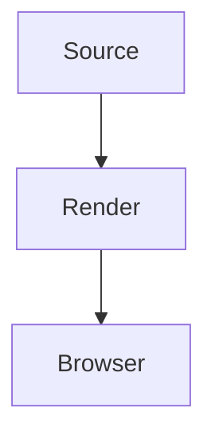

## 1. Overview

This checked-in fixture exercises the document dialect for `AC-001` and `T-010`. It keeps ordinary prose alongside an inline type, `List<String>`, and the expression {someValue} so degradation remains local.

- A reader can compare source examples.
- A reviewer can follow the rendering path.
- The bracketed reference is preserved as `[KD-3.1]`.

### 1.1 Rendered table

| Capability | Fixture evidence    | Status |
| ---------- | ------------------- | ------ |
| Components | MDX bridge elements | Ready  |
| Diagrams   | Mermaid source      | Ready  |
| References | AC-001 and T-010    | Ready  |

## 2. Component dialect

<CodeTabs>
  <CodeTab label="TypeScript">

```ts
export type Task = {
  id: 'T-010'
  completed: boolean
}

const task: Task = { id: 'T-010', completed: false }
```

  </CodeTab>
  <CodeTab label="JSON">

```json
{
  "title": "Spec Dialect Fixture",
  "status": "accepted",
  "checks": ["components", "mermaid"]
}
```

  </CodeTab>
</CodeTabs>

<Comparison>
  <Option name="Keep source visible">

Readable source gives reviewers a dependable fallback.

  </Option>
  <Option name="Enhance in browser">

The browser can replace valid Mermaid only after the document arrives.

  </Option>
</Comparison>

<DecisionMatrix score="4">

The selected path retains source while presenting a compact decision matrix.

</DecisionMatrix>

<AnnotatedDiff>

```diff
- const mode = "draft";
+ const mode = "accepted";
```

  <MarginNote line="1">The removed value was only provisional.</MarginNote>
  <MarginNote line="2">The replacement matches the fixture status.</MarginNote>
</AnnotatedDiff>

<Flowchart>
flowchart TD
  Draft[Draft] --> Review[Review]
  Review --> Accepted[Accepted]

  <NodeDetail name="Draft">An author starts with ordinary prose and examples.</NodeDetail>
  <NodeDetail name="Accepted">A reviewer confirms all required constructs.</NodeDetail>
</Flowchart>

<StepRail>
  <Step title="Author">

Write realistic source content and component children.

  </Step>
  <Step title="Render">

Convert MDX bridge elements into their documented markup.

  </Step>
  <Step title="Review">

Check both enhanced diagrams and visible fallback source.

  </Step>
</StepRail>

<FeatureViewer>

This unsupported component deliberately retains child content in its placeholder.

</FeatureViewer>

## 3. Code and diagrams

A shell command remains ordinary highlighted content:

```bash
bun run check
curl -s http://localhost:3000/api/doc
```

An unknown lexer must remain escaped source rather than failing the render:

```brainfuck
++[>++<-]>.
```

This Mermaid diagram is valid and should render in the browser:



This Mermaid diagram is intentionally malformed, so its source `<pre>` should stay visible:

```mermaid
flowchart TD
  Broken --> --> Syntax
```

### 3.1 Closing notes

The fixture includes prose, a list, a table, code, references, and supported dialect components without imports, exports, or unclosed JSX tags.
